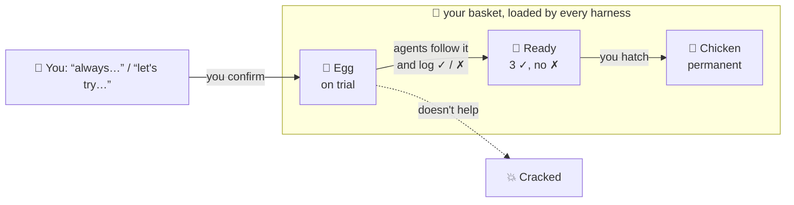

<p align="center">
  
</p>

# deveggs 🥚

*The **dev**eloper **egg**sperience: a basket of eggs for the agentic developer.*

Every developer works with agents differently. deveggs gives you **one personal
basket** of preferences, workflows and skills. Every coding agent you use (Claude Code,
Codex, …) reads it. New ideas go in as eggs on trial. Only the ones that
prove themselves become permanent.



## How it works

- **🥚 Egg:** something you want to try. Agents follow it and log whether it
  helped (✓) or got in the way (✗).
- **🐣 Ready:** 3 ✓ and no ✗. Agents suggest hatching it, but only you decide.
- **🐔 Chicken:** permanent. Agents follow it without question. If you're already
  sure ("always…", "never…"), lay it straight as a chicken.
- **💥 Cracked:** rejected or retired. It stays on file so it's never laid again.

Skills work the same way: an egg skill is on trial, a chicken skill is permanent.

## Install

Paste this into any coding agent:

```text
Install deveggs for me by following
https://github.com/kunggaochicken/deveggs/blob/main/INSTALL.md
Confirm with me before changing any files outside the deveggs repo.
```

The agent shows you what it will change and waits for your yes. Requires Node >= 22.18
and git. To install by hand, see [INSTALL.md](INSTALL.md).

## Usage

You mostly just talk to your agent. It runs these for you:

```bash
deveggs lay "End each turn with a one-line summary"   # 🥚 try it out
deveggs lay "Never push to main" --chicken            # 🐔 already sure
deveggs feedback <id> --good                          # log a trial
deveggs hatch <id>                                    # 🥚 -> 🐔
deveggs crack <id>                                    # 💥
deveggs install                                       # wire the basket into your harnesses
```

## Your basket, and everyone else's

- **`my-basket/`** is yours. It's gitignored, so `git pull` never touches it. To sync
  it across machines, fork the repo and commit it there.
- **`shared-baskets/`** holds baskets people chose to share. Borrow anything you like:
  it always enters your basket as an egg on trial. To share yours, open a PR that adds
  a reviewed copy under [`shared-baskets/<you>/`](shared-baskets/README.md).

## Why

- **Try before you commit.** Preferences you *think* you have and ones that hold up
  in practice aren't the same.
- **You hatch, agents don't.** Agents lay eggs and log trials. Only you decide what
  becomes permanent.
- **One basket, every harness.** No per-harness memory, each with its own copy and
  slant. The basket is plain Markdown under git.
- **Never explain yourself twice.** Tell one agent once, and every agent knows.

Under the hood: [architecture](assets/architecture.svg) ·
[repo setup](assets/setup.svg) · [AGENTS.md](AGENTS.md)
