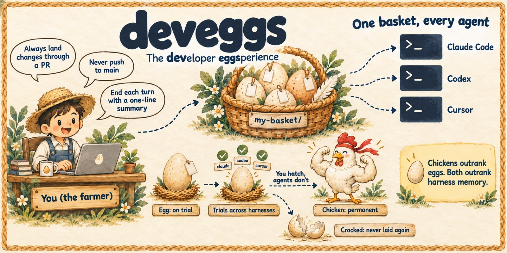

<h1 align="center">deveggs 🥚</h1>
<p align="center">
  <a href="#install"></a>
  <a href="https://x.com/kunggaochicken"></a>
  <a href="LICENSE"></a>
</p>

<h3 align="center">Capture your developer eggsperience through trial and error. Every agent you use.</h3>

<p align="center">
  
</p>

Every developer works with agents differently. Stacks like
[gstack](https://github.com/garrytan/gstack) and
[pstack](https://github.com/cursor/plugins/blob/main/pstack) are great, but they are
*someone else's* loop. Mining your old transcripts for a stack picks up weak, noisy
signals. Harness-local memory (Claude Code memory, Codex memories, Cursor rules, …)
helps, but each harness keeps its own copy and puts its own slant on it.

deveggs captures **your developer eggsperience**, the way you like to work with
agents, so any agent can reproduce it just the way you want. It lives in one personal
basket of preferences, workflows and skills that every coding agent you use reads. You
get there by trial and error: new ideas go in as eggs on trial, and the ones that
prove themselves hatch into chickens, permanent rules every agent follows.

<p align="center">
  
</p>

## How it works

- **🥚 Egg:** something you want to try. Agents follow it and log whether it
  helped (✓) or got in the way (✗).
- **🐣 Ready:** 3 ✓ and no ✗. Agents suggest hatching it, but only you decide.
- **🐔 Chicken:** permanent. Agents follow it without question. If you're already
  sure ("always…", "never…"), lay it straight as a chicken.
- **💥 Cracked:** rejected or retired. It stays on file so it's never laid again.
- **🧬 Evolved:** when trials show a rule needs narrowing, widening or rewording,
  `deveggs evolve` changes it in place. It keeps the old wording and why it changed,
  and trials restart for the new version, so only trials of the new rule count toward
  hatching.

Skills work the same way: an egg skill is on trial, a chicken skill is permanent.

deveggs is a meta skill: you never have to tell it to look for preferences. Just
work. When you correct your agent, say "always…" or "let's try…", or walk it through
the same steps again, it spots the preference on its own and asks in one line:
"Lay an egg for X?" Say yes and it's laid. Say no and nothing's saved.

## Example

Mid-task, you just say what you'd want and keep going. The agent spots the preference
and asks:

```text
> when i need something complex explained we should draw a visual diagram for it

Lay an egg for "When explaining something complex, draw a visual diagram"?

> yes

🥚 Laid when-explaining-something-complex-draw-a-visual-diagram (on trial, tag: explaining)
   When explaining something complex, draw a visual diagram alongside the explanation.
   From your words: "when i need something complex explained we should draw a visual
   diagram for it"
```

From then on, every agent draws a diagram when it explains something complex, and
logs whether the diagram helped:

```text
🥚 +1 when-explaining-something-complex-draw-a-visual-diagram
```

After three of those and no misses, your agent asks whether to hatch it into a chicken.

To review a whole session at once, run `/deveggs`. The agent turns what you said into
eggs and asks before laying any of them:

```text
> /deveggs

Your basket is empty: no chickens and no eggs yet, so there's nothing to follow or hatch.

Eggs from this session. Say the numbers you want laid; I won't lay any without your yes.

1. 🥚 Prefer agent-native setup: write instructions an agent follows, not install
   scripts. From your words: "no dont use a script. this is supposed to be agent
   native". Tag: tooling.
2. 🥚 One install should cover every agent; never make the developer repeat setup per
   harness. From your words: "we shouldn't have to paste into each coding agent…
   shouldn't one just install it into all?" Tag: tooling.
3. 🐔 Import from your global CLAUDE.md as chickens, since they're already
   "always/never" rules:
   - Always land changes through a PR; never push to main.
   - Always refer to files by full absolute path.
   - "Own through merge" means loop on CI and review until merged.

   These would also apply in Codex and Gemini, not just Claude Code.
```

Your words become eggs on trial. Rules you've already stated as "always" or "never"
go straight in as chickens, once you say yes. Once laid, every agent you use follows them.

### Make it a habit

Run `/deveggs` at the end of any session that captured a recurring pattern in how
you like to work: a habit, a workflow, a standard you hold, or something you had to
repeat or spell out very clearly. The agent mines that session for eggs. Do it
regularly and your basket captures more of your developer eggsperience each time, until every
agent works the way you do.

Agents spot eggs on their own as you work, but `/deveggs` is the reliable trigger.
You can also pass your own preference to lay it on the spot:

```text
> /deveggs always draw a diagram when explaining something complex
> /deveggs let's try ending each turn with a one-line summary
```

In an agent without slash commands, just say `deveggs: <preference>`.

## Install

Paste this into **one** coding agent (Claude Code, Codex, Cursor, …):

```text
Set up deveggs for me by following
https://github.com/kunggaochicken/deveggs/blob/main/INSTALL.md
Confirm with me before changing any files outside the deveggs repo.
```

That agent clones the repo and wires up every coding agent it finds on your machine.
It links the deveggs skill into each one and adds a short deveggs prompt to each one's
global instructions. It shows you the plan and waits for your yes. Requires
Node >= 22.18 and git.

## Usage

You mostly just talk to your agent. It runs these for you:

```bash
deveggs lay "End each turn with a one-line summary" --id turn-summary   # 🥚 try it out
deveggs lay "Never push to main" --id no-push-main --chicken            # 🐔 already sure
deveggs feedback <id> --good                                            # log a trial
deveggs evolve <id> "<new fact>" --quote "<your words>" --note "narrow: …" # tune the rule
deveggs hatch <id>                                                      # 🥚 -> 🐔
deveggs crack <id>                                                      # 💥
deveggs push                                                            # save your basket to GitHub
deveggs autopush on                                                     # then push after every change
deveggs where                                                           # print your basket's path
deveggs share --dry-run --as <you>                                      # preview sharing your basket
deveggs browse [<username>]                                             # browse shared baskets
deveggs import <username>/<id>                                          # borrow one as an egg
```

## Your basket, and everyone else's

- **`~/.deveggs/`** is yours: your basket, kept apart from the tool like `~/.claude`
  or `~/.codex`. It's its own git repo, and every change is committed locally, so
  nothing is lost. `deveggs push` saves it to a private GitHub repo, and
  `deveggs autopush on` keeps it synced there after every change. On a new machine
  you clone that repo into `~/.deveggs/`. It starts with a README (from
  [`templates/basket-README.md`](templates/basket-README.md)) that explains how to work
  with it and how to contribute back.
- **[kunggaochicken/deveggs-baskets](https://github.com/kunggaochicken/deveggs-baskets)**
  holds baskets people chose to share, apart from this repo so it stays small.
  `deveggs browse` lists them and `deveggs browse <username>` shows one;
  `deveggs import <username>/<id>` borrows an item, which always enters your basket as
  an egg on trial. To share yours, run `deveggs share --dry-run` to see what would go
  out and what it redacts, then `deveggs share` opens a PR there.

## Why

- **Try before you commit.** Preferences you *think* you have and ones that hold up
  in practice aren't the same.
- **You hatch, agents don't.** Agents lay eggs and log trials. Only you decide what
  becomes permanent.
- **One basket, every harness.** Plain Markdown under git, not locked to any one
  harness.
- **Never explain yourself twice.** Tell one agent once, and every agent knows.

## Contributing

Fixes and harness wiring are welcome by PR. See [CONTRIBUTING.md](CONTRIBUTING.md).
Shared baskets go to
[kunggaochicken/deveggs-baskets](https://github.com/kunggaochicken/deveggs-baskets)
with `deveggs share`.

Under the hood: [architecture](assets/architecture.svg) ·
[repo setup](assets/setup.svg) · [AGENTS.md](AGENTS.md)
