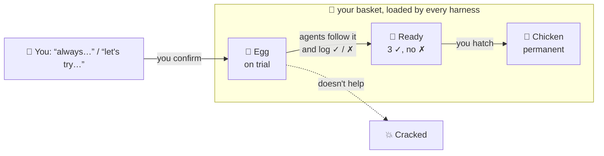

# deveggs 🥚

*The **dev**eloper **egg**sperience: a basket of eggs for the agentic developer.*

Every developer works with agents differently. Stacks like
[gstack](https://github.com/garrytan/gstack) and
[pstack](https://github.com/cursor/plugins/blob/main/pstack) are great, but they are
*someone else's* loop. Mining your old transcripts for a stack picks up weak, noisy
signals. Harness-local memory (Claude Code memory, Codex memories, Cursor rules, …)
helps, but each harness keeps its own copy and puts its own slant on it.

deveggs is a **meta-skill**. It doesn't hand you a stack. It gives you a place to
build your own: one portable basket that goes into every harness you use.



Detailed figures: [architecture](assets/architecture.svg) · [repo setup](assets/setup.svg)

## Install

Paste this into any coding agent (Claude Code, Codex, Cursor, …):

```text
Install deveggs for me by following
https://github.com/kunggaochicken/deveggs/blob/main/INSTALL.md
Confirm with me before changing any files outside the deveggs repo.
```

The agent clones this repo and previews exactly which skills and instruction files it
will touch. Then it waits for your yes. Afterwards it offers to seed your basket from
preferences you've already written down, one confirmed egg at a time. To install by
hand, follow the steps in [INSTALL.md](INSTALL.md) yourself. Requires Node >= 22.18
and git.

The repo has two kinds of basket, and the folder names keep them apart:

| folder | what it is | committed? |
|---|---|---|
| `my-basket/` | **your personal basket**, the one the CLI reads and writes | no: gitignored by default |
| `shared-baskets/<user>/` | **the repository of baskets** that people chose to share | yes, by PR |

`git pull` updates the tool and the shared baskets, and never touches `my-basket/`.
To sync your personal basket across machines, fork the repo, delete the
`my-basket` lines from `.gitignore` in your fork, and commit it there.

## Eggs and chickens

```
           lay                  feedback ✓ ✓ ✓             hatch
  idea ─────────▶ 🥚 egg ──────────────────────▶ 🐣 ready ─────────▶ 🐔 chicken
                 (on trial)                                         (permanent)
                     │                                                   │
                     └─────────────── crack ──▶ 💥 cracked ◀── crack ────┘
```

- **🥚 Egg: on trial.** A new preference, workflow, script or skill that you want to
  play with before committing to it. Each egg records its origin: your words,
  verbatim, plus the repo, harness and date. Agents follow it, but every time it clearly
  helps or gets in the way, they record a trial (`deveggs feedback <id> --good|--bad`).
- **🐣 Ready.** The egg has 3 good trials and no bad ones. Agents propose hatching
  it, but only you decide.
- **🐔 Chicken: permanent.** You liked it, so you hatched it. Agents follow it without
  question. Chickens outrank eggs, and both outrank harness-local memory. If you're
  already sure about something ("always…", "never…"), lay it straight as a chicken
  with `--chicken`.
- **💥 Cracked.** Rejected, or a chicken you've retired. It stays on file so it's
  never laid again.

Skills get the same two tiers. **Egg skills** in `my-basket/skills/eggs/` are
experimental: their description starts with `[egg: on trial]` so agents treat them
that way. **Chicken skills** in `my-basket/skills/chickens/` are your permanent toolkit.
Hatching a skill moves its folder and removes the trial marker. If a chicken skill
and an egg skill share a name, the chicken wins.

Why trial first? Preferences you *think* you have and preferences that actually
hold up in practice aren't the same. Eggs let you test an idea across real sessions
and harnesses before it becomes part of how every agent works with you. That's a
stronger signal than mining old transcripts.

## Layout

```
AGENTS.md                 canonical instructions for any agent working *in* this repo
skills/deveggs/SKILL.md   the meta-skill: teaches any agent to lay, try, hatch and crack
bin/deveggs               CLI shim -> src/cli.ts (TypeScript, run natively by Node >= 22.18)
src/                      basket model + harness installer (strict tsc, no runtime deps)
tests/                    node:test suites
my-basket/
  eggs/ chickens/ cracked/         one Markdown file per item; the folder is the tier
  skills/eggs/ skills/chickens/    trial and permanent skills (<id>/SKILL.md)
  scripts/                         scripts that script-kind items point to
  PREFERENCES.md                   generated: chickens, then eggs on trial
```

The basket holds plain Markdown and scripts under git. No database and no harness
lock-in. If you move to a new machine or harness, clone it and run `install`.

## Usage

```bash
export PATH="$HOME/Projects/deveggs/bin:$PATH"

deveggs lay "Land changes through a PR; never push to main" --tag git --chicken   # already sure
deveggs lay "End each turn with a one-line summary" --tag comms --harness claude \
  --quote "can you just give me one line at the end"                              # try it out
deveggs feedback end-each-turn-with-a-one-line-summary --good --harness codex --note "kept threads short"
deveggs lay "Release checklist" --kind skill        # egg skill: fill in the generated SKILL.md
deveggs list --tier ready                           # 🐣 eggs with clean trials
deveggs hatch end-each-turn-with-a-one-line-summary # 🥚 -> 🐔
deveggs crack some-bad-idea                         # 💥
deveggs install --dry-run      # preview the harness wiring
deveggs install                # wire the basket into Claude Code / Codex
```

`install` only does two things:

1. It symlinks `skills/deveggs` and every chicken and egg skill into each harness's
   skills directory, and removes links to skills that were cracked.
2. It adds a short managed block (`<!-- deveggs:begin --> … <!-- deveggs:end -->`)
   to each harness's global instructions file, pointing at `PREFERENCES.md`.

It never copies your preferences into a harness. The basket remains the single
source of truth. `deveggs uninstall` removes both.

## Sharing baskets: an open-source dev experience

Your personal basket stays local, or in your fork, unless you choose to share it. If
you do, open a PR that adds a reviewed copy under [`shared-baskets/<your-github-username>/`](shared-baskets/README.md).
Everyone can then browse how other developers work with agents and borrow what
looks good. A borrowed egg always enters your basket as an **egg on trial**, even
if it was a chicken for its author.

- **Review before you share.** An egg's origin holds your verbatim words and repo
  names.
- **Never commit `my-basket/` itself upstream.** Everyone would pull your eggs into
  their own basket. CI rejects it, and points you to `shared-baskets/` instead.
- **Tool improvements are welcome too.** Branch from upstream `main`, not from a
  branch that carries your personal basket.

## Philosophy

- **Try before you commit.** New ideas start as eggs. Only real trials turn them
  into chickens.
- **You hatch, agents don't.** Agents lay eggs and record trials. Only you decide
  what becomes permanent.
- **Harness-agnostic.** Trials record which harness they came from. Nothing belongs
  to any one harness.
- **Grow, don't rehash.** You should never have to explain the same preference to a
  new agent twice.
- **Small eggs.** One fact per egg. Merge and prune freely.
